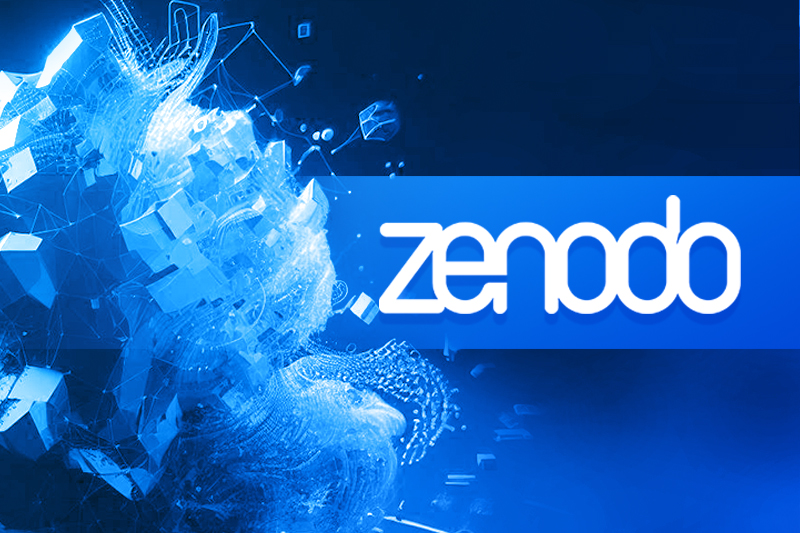

+++
title = 'Zenodo'
date = 2024-05-23T15:32:12+02:00
draft = false
+++

# From GitHub to Zenodo: pros, cons and integration of the two platforms

As researcher engineers, you understand the importance of efficient version control and collaborative development. 
GitHub has long been the go-to platform for managing and tracking code changes, but it lacks a built-in mechanism for long-term preservation or citation of code as a research output. 
This is where Zenodo becomes essential: by assigning Digital Object Identifiers (DOIs) to uploads, Zenodo easily transforms repositories on GitHub into persistent, citable resources, thereby enhancing the visibility and academic impact of your work. 
Moreover, you can link your Zenodo account to GitHub to automatically publish each new release of a GitHub repository, without manual uploads.

Supported by OpenAIRE and CERN, Zenodo guarantees the durability of your data for at least 20 years. 
In the unlikely event that Zenodo shuts down, they promise to migrate all content to another suitable repository, ensuring that all DOIs remain intact. 
This means your research will stay accessible and citable for the long term. 
By using Zenodo alongside GitHub, you ensure that your work is not only collaborative and version-controlled but also preserved and easily citable, thereby securing its academic impact and continuity.
Additionally, affiliating your work with the EPFL Zenodo Community provides access to best practice recommendations from the Library Research Data Management (RDM) team to enhance the visibility and FAIRness of your datasets and code.

The presentation is here: [Github_2_Zenodo_2022](Github_2_Zenodo_2022.pdf)

For more information:
- https://www.epfl.ch/campus/library/services-researchers/data-publication/zenodo/
- https://actu.epfl.ch/news/zenodo-epfl-community-visibility-and-fairness-of-6/
- https://go.epfl.ch/rdm 

---
Chiara Gabella, Head of team, Research data management, EPFL

Image from https://www.openaire.eu/zenodo-update-collaboration-made-easy
