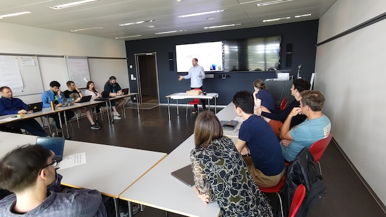
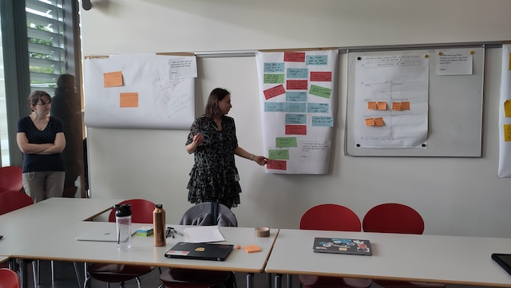
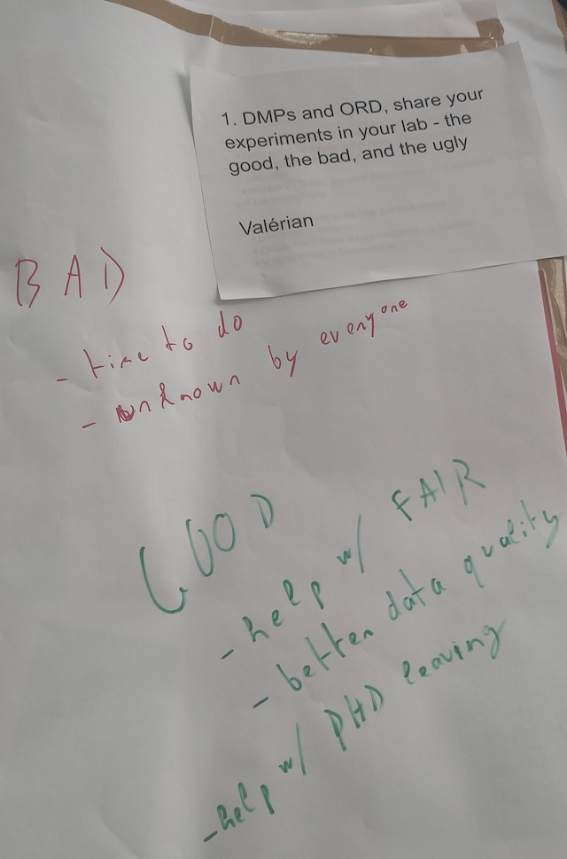
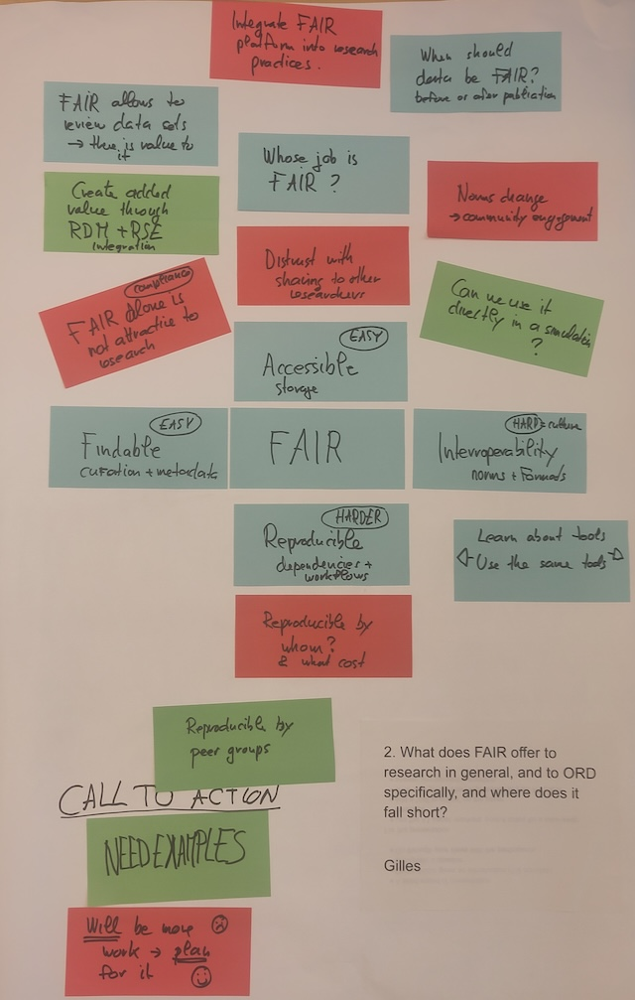
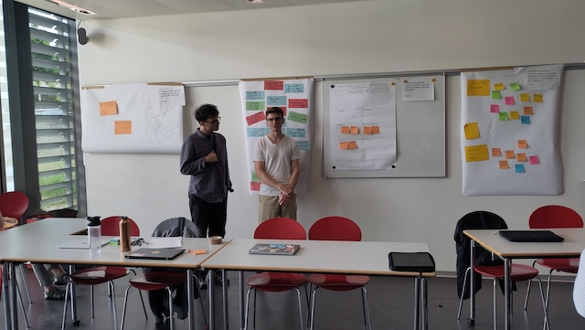
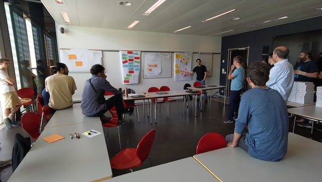
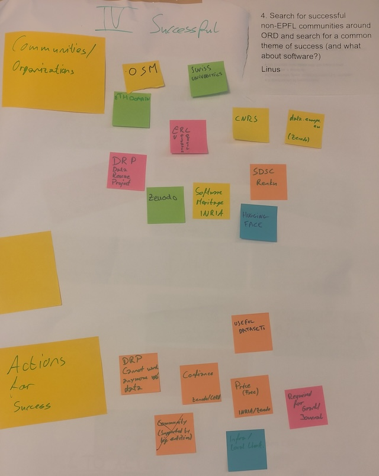

+++
title = 'RSEs as active contributors to build scientific communities around ORD'
date = 2025-05-09T10:53:30+02:00
draft = false
+++

The meeting on "RSE, ORD, and DMP" was a big success!
We discussed how RSEs can participate in Open Research Data, and what
Data Management Plans can do for the engineers and the projects.
For a lot of the RSEs present, DMP was a new acronym.
But thanks to Gilles Dubochet from EPFL's Open Science, and Chiara Gabella from the EPFL library,
we got a better idea what DMPs are, and where they can help us.

Gilles Dubochet for the introduction.

After Gilles' introduction, we split in four groups, in order to discuss the following subjects:

## 1. DMPs and ORD, share your experiments in your lab - the good, the bad, and the ugly.

TLDR: in the group, only 1 out of 4 RSE actually used a well-defined DMP. So while it
helps, most RSEs are not aware of DMPs and how to use them!

Call to Action: read up on DMPs! Either [EPFL guidelines](https://www.epfl.ch/campus/library/services-researchers/data-planning-guidelines/) or [DMP OPIDoR](https://dmp.opidor.fr/public_plans).

## 2. What does FAIR offer to research in general, and to ORD specifically, and where does it fall short?

TLDR: FAIR is very useful, but is not always easy to implement: specifically the `Interoperable`
and `Reproducible` part is hard, and needs to be defined beforehand, how long it should hold.

Call to Action: define your FAIR principles beforehand!

## 3. What topics are RSEs working on at EPFL, and which of them are linked to ORD and need DMPs?

TLDR: PLEASE HELP

Call to action: PLEASE HELP

## 4. Search for successful non-EPFL communities in ORD and search for a common theme of success (and what about software?).

TLDR: While a community can grow organically from a small project, most often it's funding
from states which uphold the community and the servers. So it's a mix of getting together the
right people, and then finding the money :)

Call to action: Choose your community wisely

